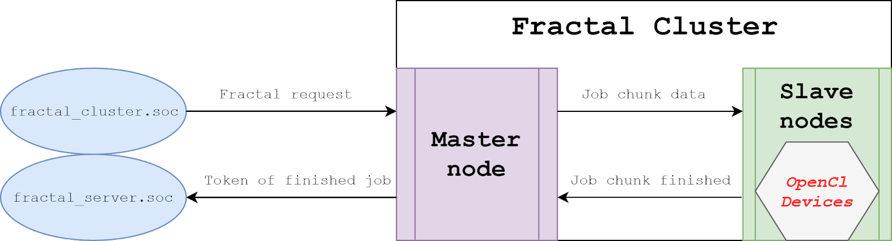
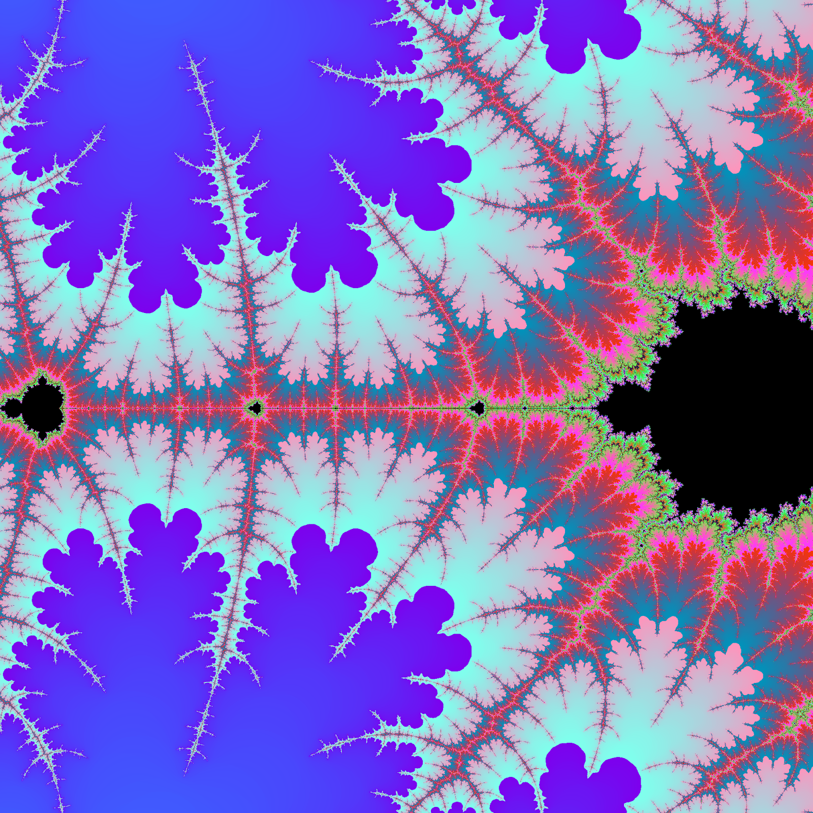

# Fractal Service

HPC cluster based on MPI comunication and OpenCL generation of fractals with GUI manager.

## Screens
### Architecture of cluster

### Mandelbrot fractal generated with cluster

### Biggest fractal created (20k x 20k pixels)

## Dependecies (Packages names listed for pacman based linux)
  - **OpenCL runtime** (One per platform type)
    - **CPU:**
      - Intel (AUR): *intel-opencl-runtime*
      - AMD (AUR):   *amdapp-sdk*
    - **GPU:**
      - NVIDIA: *opencl-nvidia*
      - Radeon: *opencl-mesa*
      - Intel:  *intel-compute-runtime*
  - **OpenCL ICD loader:** *ocl-icd*
  - **OpenCL Headers:** *opencl-headers*
  - **OpenCL Platform Info (Additional):** *clinfo*
  - **OpenMPI:** *openmpi*
  - **Creating PNG:** *libpng*
  - **GUI Manager:** *qt5*
  - **Build:** *gcc*, *make*, *cmake*
